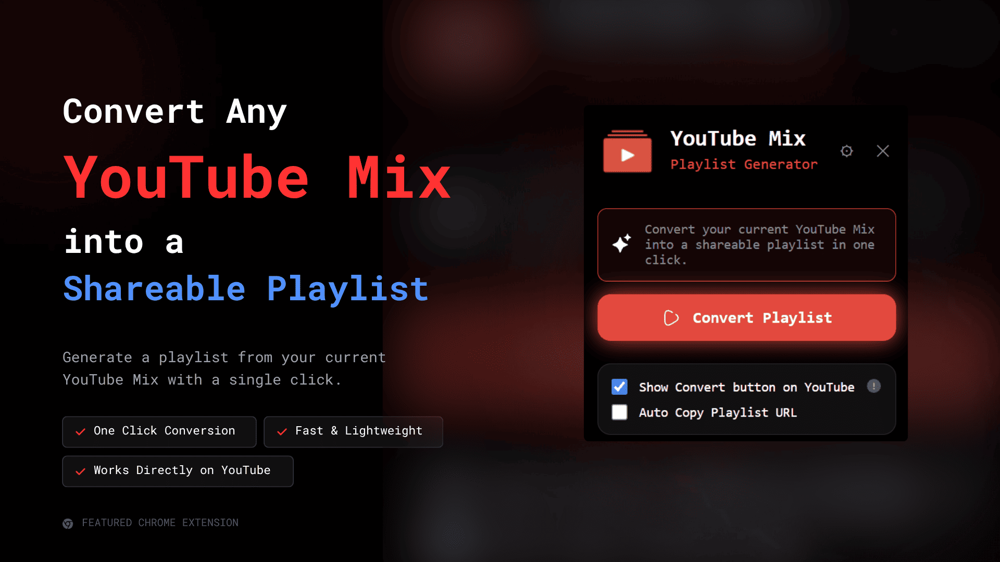

# YouTube Mix Playlist Generator



Convert YouTube Mix playlists into shareable YouTube playlists with a single click.

This Chrome extension extracts all videos from the currently opened YouTube Mix and generates a permanent playlist URL that can be viewed, shared, or saved.

---

## Features

- 🎵 Convert any YouTube Mix into a playlist
- 📋 One-click copy playlist URL
- 🔗 Open generated playlist instantly
- 📱 Generate QR code for easy sharing
- 💾 Recent playlist history
- 🌙 Dark, Light & System themes
- 🌍 Multi-language support
- ⚡ Auto-copy playlist URL
- ▶ Optional "Convert Playlist" button directly on YouTube
- 🔒 No login required
- 🚀 Fast and lightweight

---

## How it Works

1. Open any YouTube Mix.
2. Click **Convert Playlist**.
3. The extension generates a shareable playlist.
4. Copy the link, view it, or share it using the QR code.

---

## Technologies Used

- JavaScript (ES6)
- Chrome Extension Manifest V3
- Chrome Storage API
- Chrome Messaging API
- QRCode.js
- HTML5
- CSS3

---

## Project Structure

```
popup/
content/
background.js
icons/
lib/
manifest.json
```

---

## Permissions

The extension uses only the permissions required for its functionality.

- `tabs`
- `storage`

Host permission:

- `https://www.youtube.com/*`

---

## Privacy

- No user data is collected.
- No analytics or tracking.
- No external servers are used.
- Everything runs locally inside your browser.

---

## License

MIT License
